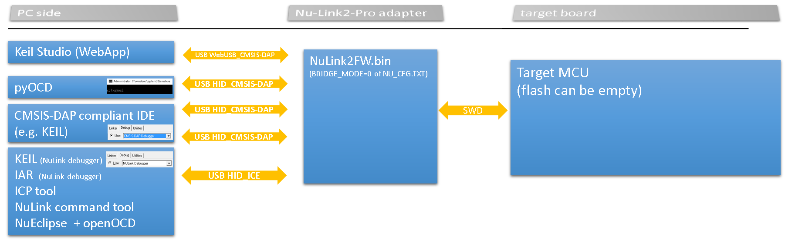
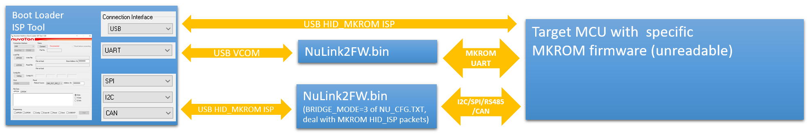

## Nu-Link2 Features

- Supports programming and debugging of all NuMicro® Family
  microcontrollers

- Supports In-Circuit Programming (ICP)

- ICP Programming Tool with image file protection

- Drag & drop Flash programming

- USB flash drive, SD card and SPI Flash as image file storage

- Start button

- Automatic IC programming system connector (Control Bus)

- Powered by Micro USB or target-powered via SWD interface

- Support In-System Programming (ISP)

- Supports PC control ISP

- Supports ISP Programming Tool

- Supports multi-debug interfaces and tool

- Supports Serial Wire Debug (SWD)

- Unlimited breakpoint and step execution

- Supports Arm DAPLink

- Supports PyOCD

- Virtual COM port by USB

## System Overview

Overview of software tools, Nu-Link2 adapters, and targets:

## Driver Installation

For Windows operating systems, please download and install the [Nu-Link_USB_Driver](https://www.nuvoton.com/resource-download.jsp?tp_GUID=SW1120201207161057)

## Nu-Link2-Pro Firmware

1. When you upgrade NuLink2FW.bin to a version greater than or equal to v3.09.7380, you will see some options in NU_CFG.TXT:

- Open the NU_CFG.TXT file in the pop-up "NuMicro MCU" disk
    

- Set CMSIS-DAP=1; this is the default setting. It has a WebUSB interface conforming to the CMSIS-DAP protocol, and you can connect to KEIL Studio Cloud via this interface.
- Set CMSIS-DAP=0; this will disable CMSIS-DAP and enable the Nu-Link2 "USB BULK_ICE" interface (it's faster than "USB HID_ICE").

## Other Example Projects for Nu-Link2

- [DAPLink on Nu-Link2-Pro](https://github.com/OpenNuvoton/DapLink)
- [Nu-Link2-CMSIS_DAP](https://github.com/OpenNuvoton/NuLink2_CMSIS_DAP)
- [Nu-Link2-ICP_Library](https://github.com/OpenNuvoton/NuLink2_ICP_Library)
- [Nu-Link2-Pro_Offline_ISP](https://github.com/OpenNuvoton/Nu-Link2-Pro_Offline_ISP)

### Comparison of Nu-Link2 and DAPLink

#### Nu-Link2

- Proprietary code
- Supports NuMicro 8051, offline programming, encryption during data transmission, unlimited flash breakpoints, NuMicro chip-specific features (config0/config1 dataflash setting, KPROM, etc.)
- USB interfaces: MSC/VCOM/HID_ICE (proprietary commands) or CMSIS-DAPv2 WinUSB + WebUSB CMSIS-DAP/VCOM_Nu-Link2-Bridge or HID_ISP (defined by BRIDGE-MODE in NU_CFG.TXT)

#### DAPLink

- Open source: [DAPLink on Nu-Link2-Pro](https://github.com/OpenNuvoton/DapLink)
- Supports many third-party IDEs
- USB interfaces: MSC/CDC/CMSIS-DAPv2 WinUSB/WebUSB CMSIS-DAP

#### CMSIS_DAP

- Open source: [Nu-Link2-CMSIS_DAP](https://github.com/OpenNuvoton/NuLink2_CMSIS_DAP)
- Supports many third-party IDEs

